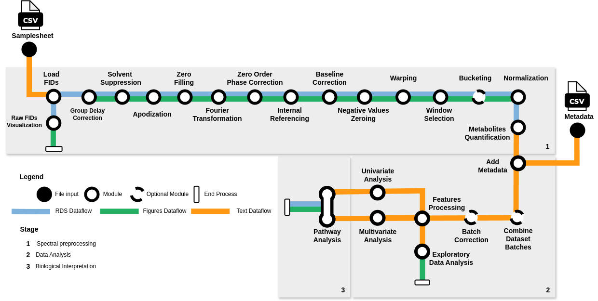

# NASQQ: Nextflow Automatization and Standardization for Qualitative and Quantitative 1H NMR Metabolomics

<!-- TABLE OF CONTENTS -->
<details>
  <summary>Table of Contents</summary>
  <ol>
    <li><a href="#about-the-project">About The Project</a></li>
    <li><a href="#workflow-overview">Workflow Overview</a></li>
    <li><a href="#getting-started">Getting Started</a>
      <ul>
        <li><a href="#prerequisites">Prerequisites</a></li>
        <li><a href="#project-setup">Project Setup</a></li>
      </ul>
    </li>
    <li><a href="#final-remarks">Final Remarks</a>
      <ul>
        <li><a href="#tests">Tests</a></li>
        <li><a href="#memory-allocation">Memory Allocation</a></li>
        <li><a href="#license">License</a></li>
        <li><a href="#contact">Contact</a></li>
        <li><a href="#credits-and-acknowledgments">Credits and acknowledgments</a></li>
        <li><a href="#citations">Citations</a></li>
      </ul>
    </li>
  </ol>
</details>

<!-- ABOUT THE PROJECT -->
## About The Project

**NASQQ** is a comprehensive pipeline designed to automate the preparation and analysis of 1H NMR metabolomics data. It streamlines the process from raw Bruker FIDs through spectral preprocessing and metabolite identification to data analysis and pathway enrichment. This approach accelerates the comprehension of metabolomics in analyzed subjects, eliminating the need for specialized domain knowledge.

<!-- FEATURES -->
### Features

- **Automated Workflow**: NASQQ automates the entire metabolomic analysis process, reducing manual intervention and ensuring reproducibility.
- **Comprehensive Analysis**: The pipeline covers spectral preprocessing, metabolite identification, data analysis, and pathway enrichment, providing a holistic view of the metabolomic data.
- **Machine Learning Integration**: NASQQ incorporates machine learning methods to bridge the gap between raw spectral information and biological insights.

<!-- WORKFLOW OVERVIEW -->
### Workflow overview



1. **Load FIDs**: Retrieve raw FIDs from a specified location, extract sample names, and filter pulse program.
2. **Raw FIDs Visualisation**: Plot raw FIDs figures.
3. **Group Delay Correction**: Eliminate Bruker Group Delay from the FIDs.
4. **Solvent Suppression**: Estimate and eliminate residual solvent signals from the FIDs.
5. **Apodization**: Enhance the Signal-to-Noise ratio in the spectra.
6. **Zero Filling**: Enhance the visual clarity of spectra by inserting zeros.
7. **Fourier Transformation**: Convert FIDs from the time domain to frequency domain spectra using Fourier Transformation.
8. **Zero Order Phase Correction**: Adjust spectra phase to ensure pure absorptive mode in the real part.
9. **Internal Referencing**: Align spectra with an internal reference compound.
10. **Baseline Correction**: Estimate and remove spectral baseline from the spectral profiles.
11. **Negative Values Zeroing**: Set all negative values in spectra to zero.
12. **(Optional) Warping**: Apply Semi-Parametric Time Warping technique to warp and realign spectra.
13. **Window Selection**: Choose the informative segment of spectra.
14. **(Optional) Bucketing**: Simplify density of spectra peaks.
15. **Normalization**: Normalize the spectra.
16. **Metabolites Quantification**: Identify and quantify metabolites based on normalized spectra.
17. **Add Metadata**: Merge metadata with quantified metabolites' relative abundances.
18. **(Optional) Combine Dataset Batches**: Merge batches from the dataset for streamlined analysis.
19. **(Optional) Batch Correction**: Remove batch effect from the data.
19. **Features Processing**: Load data and perform sanity checks.
20. **Exploratory Data Analysis**: Conduct Principal Component Analysis and generate exploratory analysis visualizations.
21. **Univariate Analysis**: Identify outliers, assess data normality, and conduct univariate statistical tests.
22. **Multivariate Analysis**: Utilize machine learning models to analyze metabolite data.
23. **Pathway Analysis**: Perform pathway enrichment analysis using KEGG database entries.

For detailed information on each stage of the analysis and scripts, refer to [docs](./docs) folder, where separate README.md files are provided.

---
> *Note: NASQQ is an extension of existing solutions, aimed at enhancing the accessibility and efficiency of metabolomic data analysis. The Workflow is designed to be system agnostic, however it 
> was tested on MacOS (M1 chip) and Linux (Ubuntu 22.04). In order to use pipeline on Windows system please refer to [WSL](https://learn.microsoft.com/pl-pl/windows/wsl/about)*
<div align="right"><a href="#nasqq-nextflow-automatization-and-standardization-for-qualitative-and-quantitative-1h-nmr-metabolomics">(Back to Top)</a></div>

<!-- GETTING STARTED -->
## Getting Started

To begin using the pipeline, it's essential to ensure that certain prerequisites are met and project is properly set up. Please review the following sections:

<!-- PREREQUISITIES -->
### Prerequisites

1. Install [Docker](https://docs.docker.com/engine/install)
2. Install [NextFlow](https://www.nextflow.io/docs/latest/getstarted.html#installation)
3. (Optional) Install [precommit](https://pre-commit.com/#install)

<!-- PROJECT SETUP -->
### Project setup

1. Clone the project's Github repository to your local machine:
   
   ```sh
   git clone https://github.com/ardigen/nasqq
   ```


> *Note: Grant appropriate permissions to the workflow directory e.g. `chmod 777 -R <location>/nasqq`*

Processes executed in the NASQQ pipeline are maintained in a containerized environment. The project repository includes prebuilt Docker images for the execution of all modules, **r_utils** and **python_utils**, available [here](https://github.com/orgs/ardigen/packages?repo_name=nasqq). Nextflow manages all dependencies as links to the appropriate Docker containers are included in the [base.config](./conf/base.config). However, if there are issues with repository, the necessary Dockerfiles compatible with Linux and MacOS (M1 chips) systems, are provided. These Docker images can be built locally for both [R](./docker/R/Dockerfile) and [Python](./docker/Python/Dockerfile) environments.

For Linux user execute:
 ```sh
cd nasqq/docker/Python
./build_docker_linux.sh
cd nasqq/docker/R
./build_docker_linux.sh
 ```

For MacOS (M1) user execute:
 ```sh
cd nasqq/docker/Python
./build_docker_macos.sh
cd nasqq/docker/R
./build_docker_macos.sh
 ```

2. After setting up project create coma separated [manifest.csv](./tests/manifest.csv) file, with following structure and headers:

```csv
dataset,batch,input_path,metadata_file,selected_sample_names,target_value,referencing_range,window_selection_range
test1,test1,./testthat/data/dataset/dataset1,./testthat/data/metadata/metadata1.csv,500;501;503;504,0,None,0;10
test2,test2,./testthat/data/dataset/dataset2,./testthat/data/metadata/metadata2.csv,all,0,None,0;5
test3,None,./testthat/data/dataset/dataset3,./testthat/data/metadata/metadata3.csv,502;505;507;508;509;510,2,2.5;4.55,0;10
```

* `dataset` - name of dataset.
* `batch` - batch name (Default: `None`).
* `input_path` - absolute path to NMR dataset in Bruker format.
* `metadata_file` - absolute path to metadata file to be merged with dataset.
* `selected_sample_names` - selection of sample names, ";" separated (Default: `all`).
* `target_value` - PPM value of the signal used as the internal reference spectra (Default: 0). 
* `referencing_range` - if `target_value` is different from the default, the range where the referencing signal will be searched (Defaul: `None`).
* `window_selection_range` - range of the informative part of the spectra, separated by ";" (Default: `0;10`). 

As of version 1.0.0 of the NASQQ pipeline, the only supported input files are in Bruker format. These must include at a minimum the files `acqu`, `acqus`, `pulsprogram`, and the `pdata` subfolder. An exemplary dataset folder structure is shown below.

```bash
data/dataset/
├── 10
│   ├── acqu
│   ├── acqus
│   ├── fid
│   ├── pdata
│   │   └── 1
│   │       ├── 1i
│   │       ├── 1r
│   │       ├── outd
│   │       ├── proc
│   │       ├── procs
│   │       └── title
│   ├── pulseprogram
│   ├── scon2
│   ├── specpar
│   ├── uxnmr.info
│   └── uxnmr.par
├── 11
│   ├── acqu
│   ├── acqus
│   ├── audita.txt
│   ├── fid
│   ├── pdata
│   │   └── 1
│   │       ├── 1i
│   │       ├── 1r
│   │       ├── outd
│   │       ├── proc
│   │       ├── procs
│   │       └── title
│   ├── pulseprogram
│   ├── scon2
│   ├── specpar
│   ├── uxnmr.info
│   └── uxnmr.par
```

3. If the necessary `metadata_file` referenced in [manifest.csv](./tests/manifest.csv) does not yet exist, create it and provide the appropriate paths. The file should contain meta-information about corresponding `input_path` datasets. Each metadata file must be in CSV format, with three columns: `patient_no`, `batch`, and a column for state information relevant to the data analysis module, such as disease, gender, or checkpoint, with the column name not being hardcoded. As the pipeline design supports only pairwise classification of samples, having more than two groups will trigger a warning, and the pipeline will terminate during the **Data Analysis** stage. If there is no batch separation, the `batch` column should be filled with `"None"` values.

> *Note: The [manifest.csv](./tests/manifest.csv) file should include dataset-specific local parameters. Metadata files may contain more records than the specific dataset, but only those records that can be mapped to folders found in `input_path` will be used.*  

4. The final file that needs to be created is [params.yml](./tests/params.yml). This document outlines the required inputs for configuring the data processing pipeline and consists of global parameters for the pipeline and its stages. These parameters are applied run-wise. Ensure that you fill in the necessary values according to the tables below (a-d).


  a. **Pipeline**


| **Input**     | **Description**                                                                         | **Datatype** |
|---------------|-----------------------------------------------------------------------------------------|--------------|
| manifest      | Absolute path to the manifest.csv file containing metadata information for the analysis | string       |
| outDir        | Absolute path to the directory where the output files will be stored                    | string       |
| reportsDir    | Absolute path to the directory where the analysis reports will be generated             | string       |
| workDir       | Absolute path to the directory where the intermediate work files will be stored         | string       |
| launchDir     | Absolute path to the directory from which the pipeline is launched                      | string       |
| maxRetries    | Number of attempts the pipeline should make to process a task before giving up          | integer      |
| errorStrategy | The strategy to handle errors during pipeline execution (terminate/ignore/retry)        | string       |


  b. **Spectral processing**


| **Input**            | **Description**                                                                                | **Datatype** |
|----------------------|------------------------------------------------------------------------------------------------|--------------|
| check_pulse_samples  | The pulse program specified in the manifest file for processing (e.g., cpmgpr1d, noesy1d)      | string       |
| rm_duplicated_names  | Enable/disable removing duplicated sample names                                                | boolean      |
| lambda_bc            | Baseline correction lambda parameter, controlling the smoothness of the baseline               | integer      |
| p_bc                 | Baseline correction parameter, controlling stickiness of the baseline                          | float        |
| reverse_axis_samples | Specifies whether to reverse the axis for all samples or selected samples based on a threshold | string       |
| run_bucketing        | Enable/disable bucketing for simplifying the density of peaks before metabolite quantification | boolean      |
| intmeth              | Type of bucketing, either rectangular "r" or trapezoidal "t"                                   | string       |
| mb                   | Number of buckets, default values should be greater than 5000                                  | integer      |
| run_warping          | Enable/disable warping for spectra re-alignment based on a reference spectrum                  | boolean      |
| type_norm            | Normalization type: one of "mean", "pqn", "median", "firstquartile", "peak"; default is "pqn"  | string       |
| removal_regions      | Spectral regions to be removed (e.g., Water = c(4.5, 5.1), Noise = c(0.0, 0.1))                | string       |
| ncores               | Number of threads allocated for the ASICS quantification task                                  | integer      |
| quantif_method       | Metabolite quantification method: "FWER", "Lasso", or "both"                                   | string       |


  c. **Data analysis**


| **Input**                   | **Description**                                                             | **Datatype** |
|-----------------------------|-----------------------------------------------------------------------------|--------------|
| run_combine_project_batches | Enable/disable merging datasets for data analysis where batch is not "None" | boolean      |
| run_batch_correction        | Enable/disable ComBat batch correction                                      | boolean      |
| log1p                       | Enable/disable log1p normalization of metabolites before data analysis      | boolean      |
| metadata_column             | The column name containing state information for the data analysis module   | string       |
| zeronan_threshold           | Threshold for zero or NaN values in multivariate analysis (range: 0-1)      | float        |
| test_size                   | Test size for splitting data in multivariate analysis, default = 30%        | float        |
| cross_val_fold              | Cross-validation folds for Logistic regression CV model, default = 2        | integer      |
| pvalue_shapiro              | P-value threshold for normality (Shapiro-Wilk test), default = 0.05         | float        |


  d. **Biological interpretation**


| **Input**   | **Description**                                                                   | **Datatype** |
|-------------|-----------------------------------------------------------------------------------|--------------|
| top_n       | Number of metabolites to include in enrichment for pathway analysis, default = 20 | integer      |
| kegg_org_id | KEGG organism ID, default is human "hsa"                                          | string       |


> *Note: The [params.yml](./tests/params.yml) file consolidates all global parameters required for executing the pipeline using the `-params-file` flag. Alternatively, the pipeline can be executed without creating this file by specifying each parameter as a separate flag, such as `--run_warping True` or `--ncores 3`, in accordance with Nextflow [configuration](https://www.nextflow.io/docs/latest/config.html).* 

5. After completing every step open [run.sh](./tests/run.sh) and adjust paths for execution of workflow or run manually using command: 

```sh
nextflow run ../main.nf \
    -c ../nextflow.config \
    -profile standard \
    -params-file params.yml
```
<div align="right"><a href="#nasqq-nextflow-automatization-and-standardization-for-qualitative-and-quantitative-1h-nmr-metabolomics">(Back to Top)</a></div>

<!-- FINAL REMARKS -->
## Final remarks

<!-- TESTS -->
### Tests

In order to run the test data simply go the tests directory and run the test run:

```sh
./tests/run.sh
```
<!-- MEMORY ALLOCATION -->
### Memory allocation

Please remember that based on the number of datasets provided in the manifest your local machine has to have that many resources. [visit this thread: https://github.com/nextflow-io/nextflow/issues/1787] The lack of resources can lead to incorrect memory allocation in the script. It is recommended to change **max_cpus** and **max_memory** params in [nextflow.config](./nextflow.config) file accordingly to resources avaibale on your local machine. 

example:
```
 *** caught segfault ***
  address 0x7ff0000000000003, cause 'memory not mapped'
```

Be aware that NextFlow is not a resource orchestration system. If you need it, there is a need of creation of custom executor like aws or kubernetess.

>Note: The default setting for the computation cannot be lower than:
> * cpus = 2
> * memory = 2.GB RAM

<!-- LICENSE -->
### License

NASQQ is distributed under the MIT License. See [`LICENSE.md`](./LICENSE.md) for more information.

<!-- CONTACT -->
### Contact

For contact purposes, there is a dedicated email address: [nasqq@ardigen.com](nasqq@ardigen.com)

<!-- CREDITS AND ACKNOWLEDGMENTS -->
### Credits and acknowledgments

The scripts and workflow was originally created as a part of [Łukasz Pruss's](https://pl.linkedin.com/in/%C5%82ukasz-pruss-717965186) PhD project, in collaboration between Ardigen S.A. and Wrocław University of Science and Technology (WUST). A special acknowledgment goes to [Oskar Gniewek](https://pl.linkedin.com/in/oskar-gniewek), whose expertise and critical feedback significantly contributed to the implementation of NextFlow. He also played a crucial role in managing unit and integration tests, as well as handling dependencies across various systems for pipeline execution. 

Furthermore, many people were involved in the evolution of the pipeline, turning it from a concept into an end-to-end solution. These contributors include:

* [Wojciech Wojtowicz](https://www.linkedin.com/in/wmwojtowicz/)
* [Tomasz Jetka](https://www.linkedin.com/in/tomaszjetka/)
* [Kaja Milanowska-Zabel](https://www.linkedin.com/in/kajamilanowska/)
* [Piotr Młynarz](https://www.linkedin.com/in/piotr-mlynarz-816817103/)

Special thanks for the assistance in development process, code reviews and tips are extend to: 

* [Paweł Biernat](https://www.linkedin.com/in/pawel-biernat-a0b160109/)
* [Michał Jakubaczak](https://www.linkedin.com/in/micha%C5%82-jakubczak-5200b0189/)
* [Błażej Szczerba](https://www.linkedin.com/in/b%C5%82a%C5%BCej-szczerba-26b600b/)
* [Filip Wątorek](https://www.linkedin.com/in/filip-w%C4%85torek/)

<!-- CITATIONS -->
### Citations

An extensive list of references and packages used by the pipeline can be found in our publication:

> **NASQQ: Nextflow automatization and standarization for qualitative and quantitative 1H NMR metabolomics data preparation and analysis.**
>
> Łukasz Pruss, Oskar Gniewek, Tomasz Jetka, Wojciech Wojtowicz, Kaja Milanowska-Zabel, Piotr Młynarz.
>
> DOI: [--](---)

If you want to utilize NASQQ for your analysis, please refer to [LICENSE.md](./LICENSE.md)

To cite the `nf-core` publication use:

> **The nf-core framework for community-curated bioinformatics pipelines.**
>
> Philip Ewels, Alexander Peltzer, Sven Fillinger, Harshil Patel, Johannes Alneberg, Andreas Wilm, Maxime Ulysse Garcia, Paolo Di Tommaso & Sven Nahnsen.
>
> _Nat Biotechnol._ 2020 Feb 13. doi: [10.1038/s41587-020-0439-x](https://dx.doi.org/10.1038/s41587-020-0439-x).

<div align="right"><a href="#nasqq-nextflow-automatization-and-standardization-for-qualitative-and-quantitative-1h-nmr-metabolomics">(Back to Top)</a></div>
